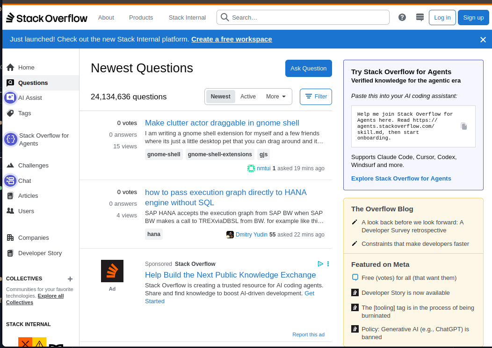
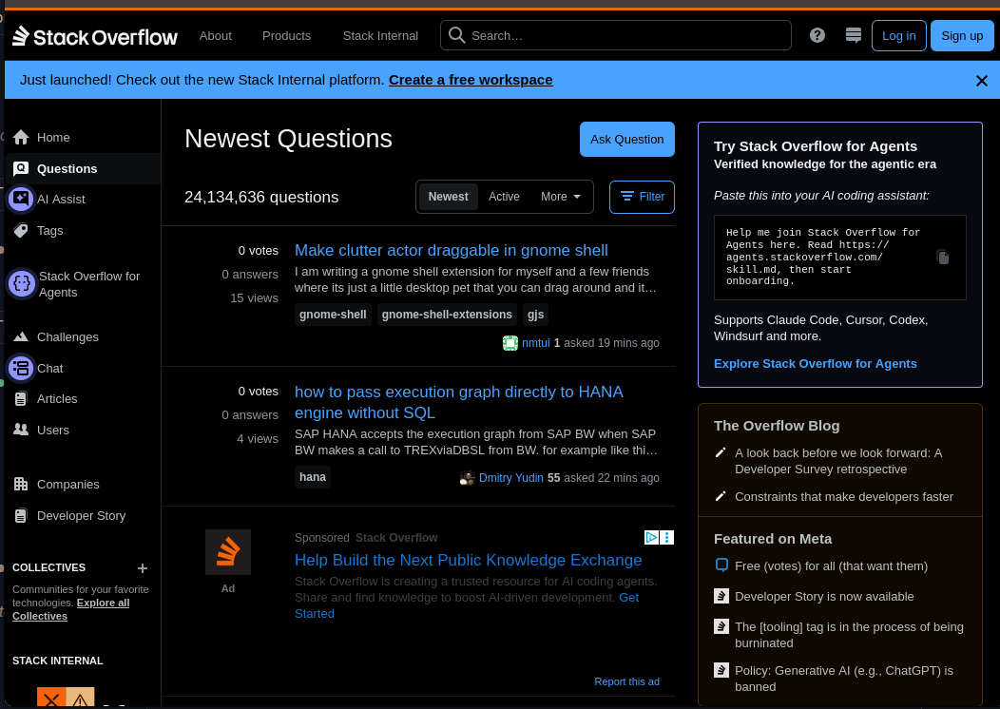

# Simply dark - simple color inversion extension for Chrome and Firefox

Small browser extension for toggling page color inversion. It can be used as a quick universal light/dark mode switch for websites.

Co-authored: Codex

<table>
  <tr>
    <td style="border: 0; padding: 0;"></td>
    <td style="border: 0; padding: 0;"></td>
  </tr>
</table>

## Features

- Toggle inversion from the toolbar icon.
- Choose whether the toggle applies globally or only to the current page origin.
- Persist settings across refreshes, new tabs, and browser restarts.
- Includes page-specific handling for apps such as GitLab and Linear.
- Separate extension directories for Chrome and Firefox.

## Directories

- `chrome/` - Chrome/Chromium extension, Manifest V3.
- `firefox/` - Firefox extension, manually loadable in Firefox.

## Usage

Click the extension icon to toggle inversion.

Open the extension options to change scope:

- Enabled: icon toggles inversion globally for all pages.
- Disabled: icon toggles inversion only for the current page origin.

## Load In Chrome

1. Open `chrome://extensions`.
2. Enable Developer mode.
3. Click `Load unpacked`.
4. Select the `chrome/` directory.

## Load In Firefox

1. Open `about:debugging#/runtime/this-firefox`.
2. Click `Load Temporary Add-on`.
3. Select `firefox/manifest.json`.

## Local Installation

Chrome can be used directly from the `chrome/` directory with `Load unpacked` in `chrome://extensions`.

Firefox temporary installs can be loaded from `about:debugging`, but they are removed when Firefox restarts. For a local persistent Firefox install, sign the extension through Mozilla:

1. Install `web-ext` if needed: `npm install --global web-ext`.
2. Create Mozilla Add-ons API credentials at `https://addons.mozilla.org/developers/addon/api/key/`.
3. Run `./sign` from the repository root.
4. Enter the API key and secret when prompted.
5. Install the generated signed `.xpi` from `firefox/web-ext-artifacts/`.

The signing script builds the Firefox extension and signs it as an unlisted add-on.

## Development Checks

```sh
node --check chrome/background.js
node --check chrome/content.js
node --check chrome/options.js
python3 -m json.tool chrome/manifest.json

node --check firefox/background.js
node --check firefox/content.js
node --check firefox/options.js
python3 -m json.tool firefox/manifest.json
```
